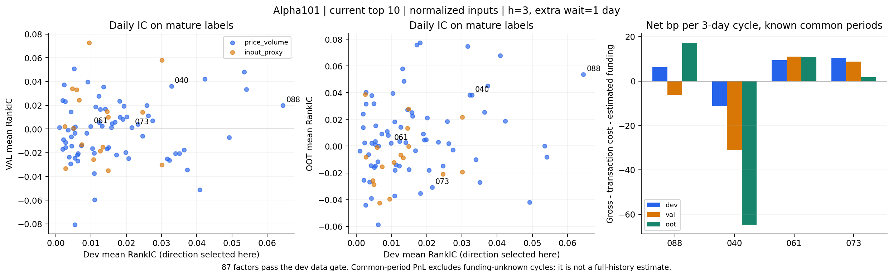
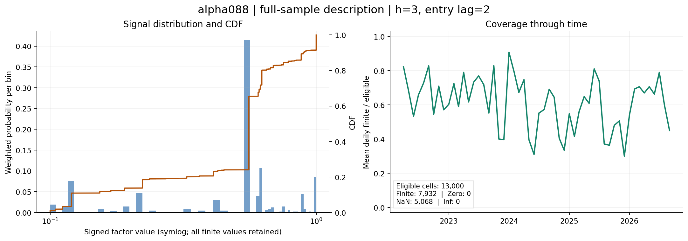
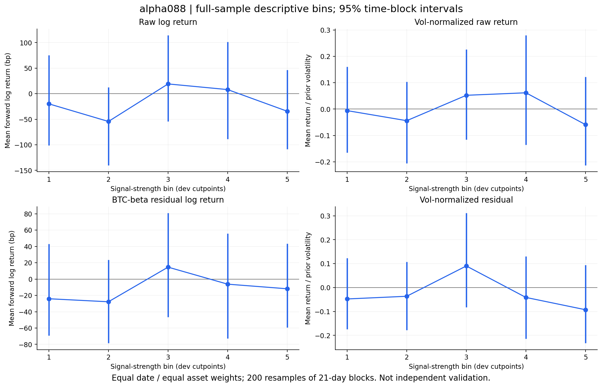
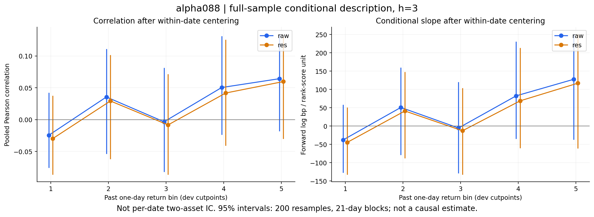
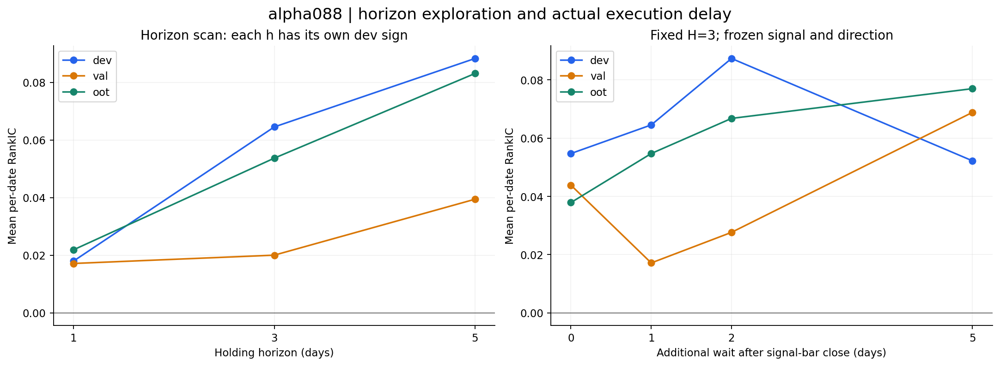
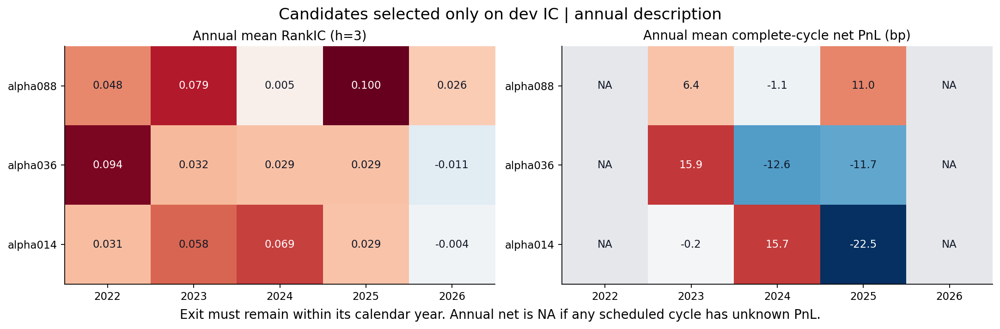
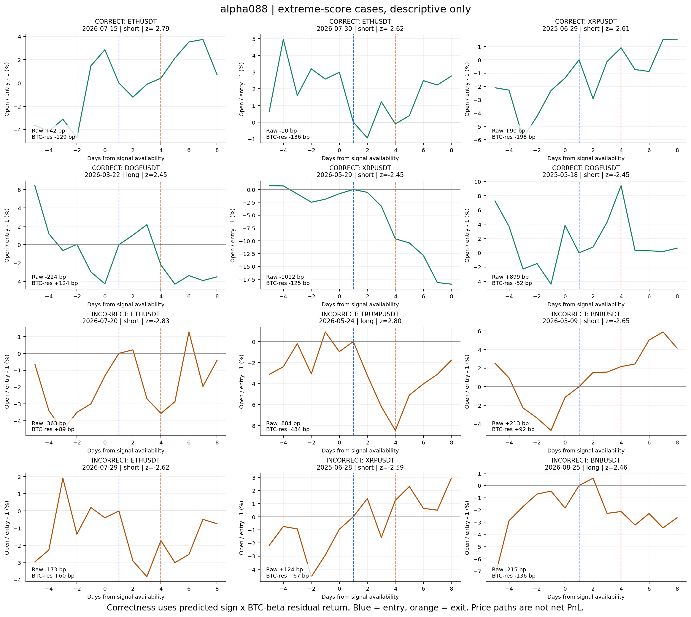

# Alpha101 在成交额前十加密永续上的评估报告

> v2 · 2026-09-10 · 已重新取数、实现、回测和生成图表。日线数据截止 2026-09-09 UTC；旧版小时线结果不纳入本版。

## 1. 本次得到了什么

**Alpha101 中能找到选币排序信息，但本轮尚未确认稳定、可直接部署的交易因子。** 结论来自实际重跑：按成交额确定当前前十，同时重建历史月度前十；每个池都评估全部 101 个公式的原始输入与归一化输入版本。

主要发现有三点：

1. **归一化主口径中，alpha088 保留研究价值，alpha040 应降低优先级。** 088 在当前前十的三段 RankIC 为正，但验证段扣费后亏损；换成历史月度前十，后段 IC 接近零。040 虽然也有正 IC，主口径三段净收益均为负。
2. **原始输入下，alpha042、alpha094 的排序信息更突出。** 这两个候选应进入下一轮清单；但当前前十的验证段净收益仍为负，且原始输入对币种计价单位敏感，不能据此认定发现了稳定交易优势。
3. **少数连续正收益结果，不能单独作为通过依据。** 主口径的 87 个数据合格因子中，仅 061、073 在共同可核算周期内三段净收益为正；它们的 IC 很弱，收益不确定性大，换池或换输入后也不保持。

这里的“净收益”含实际历史资金费率与部分标记价格代理。少数周期资金费仍未知，因此正文收益表统一比较共同可核算周期，完整历史净收益另存为 NA。第 4 节列出排除日期及其影响。



## 2. 使用了哪些数据，前十如何确定

### 2.1 全部输入来自 Binance 公开历史接口

本轮全部输入取自 Binance 公开历史接口。历史 PIT 流通市值与行业分类**没有可回测的公开来源**：能取到的只是当日快照，而当日快照不能回填过去各期，因此依赖这两项的 19 条公式一律标注为输入替代，不假装取得了历史值。逐条可用性证据见 [`references/data_availability.md`](references/data_availability.md)。

| 输入 | 实际来源与处理 |
|---|---|
| OHLC、基础币成交量、USDT 成交额 | `fapi/v1/klines` 日线；653 个 USDT、PERPETUAL、COIN 类合约下载成功，覆盖 2021-01-01 至 2026-09-09 内各自返回的历史 |
| 日内 VWAP | 每日 `quote_volume / base_volume`，基础量为零时缺失 |
| 逐次资金费 | Binance 公开网页资金费历史；保留实际时间、费率、逐条结算间隔；另用 `fapi/v1/fundingRate` 核查缺口 |
| 历史标记价格 | 优先使用资金费响应价格；缺价时使用同一整点的 8h/4h/1h 标记价格 K 线开盘价代理，来源逐条标记 |
| 历史流通市值、行业分类 | 本次未取得可回测的 PIT 历史；19 条相关公式明确使用替代输入 |
| 历史点差、深度、账户级数据 | 本轮未取得；没有据此计算容量、冲击或参与者增量 |

原始下载保留首尾、去重及 SHA256 记录。实际计算又按合约上线、终止时间过滤：首个不完整交易日不参与信号，终止后的零成交占位 K 线不能用于排名或收益。PUMP 等代码的更早历史也不越过当前登记的上线边界。登记表本身并非完整历史合约主表，已经消失或发生代码复用的历史仍是限制。

详见[数据可用性与核查证据](references/data_availability.md)。

### 2.2 当前前十：过去 30 个完整 UTC 日的平均成交额

排序窗口为 **2026-08-11—2026-09-09**；使用 USDT 报价成交额，近似美元成交额，避免按“币的个数”比较成交量。只从当前交易中的合约选取，排除稳定币基币、指数和非 COIN 类合约。

| 名次 | 合约 | 日均成交额，十亿 USDT |
|---|---|---|
| 1 | BTCUSDT | 11.346 |
| 2 | ETHUSDT | 8.656 |
| 3 | SOLUSDT | 1.969 |
| 4 | ZECUSDT | 1.417 |
| 5 | XRPUSDT | 1.218 |
| 6 | HYPEUSDT | 0.823 |
| 7 | DOGEUSDT | 0.484 |
| 8 | BNBUSDT | 0.384 |
| 9 | TRUMPUSDT | 0.352 |
| 10 | ENAUSDT | 0.325 |

当前前十为 BTC、ETH、SOL、ZEC、XRP、HYPE、DOGE、BNB、TRUMP、ENA。本版用实际排序得到的 TRUMP，替换旧版名单中的 PEPE。

“当前前十回看历史”有事后选币偏差，也不意味着过去每一天都有十个可交易币：上市不足 60 个完整日线的币不准入。评估区间的合格池为 7—10 币；归一化和具体公式需要更长窗口，最终有效信号可能更少。每次至少有 5 个有效资产才计算 IC 或建仓。

### 2.3 历史月度前十：减少当前名单带来的偏差

每月首日用上月末已完成的过去 30 日成交额均值选前十，并要求至少 60 个完整历史日线；2022-04—2026-09 共 54 次调整、80 个入池币。公式内部的横截面排名也只使用该日合格池，不能用事后入池并集排名。

2021 年数据用于窗口预热，预热期入池名单单独保存。当前登记表包含尚能查询的终止合约，但缺少已完全消失的合约，故历史前十仍只能称为“当前登记集合内重建的历史前十”，不能宣称完全消除了幸存者偏差。

## 3. Alpha101 如何迁移到币种数据

来源为 Kakushadze 的 [*101 Formulaic Alphas*](https://arxiv.org/abs/1601.00991)。本轮保留 101 个独立编号，并区分两类：

- **82 条价量公式**：无需市值或行业替代；仍采用下列公开、可重复的本地算子约定。
- **19 条输入替代公式**：#56 用滞后 30 日成交额均值代理市值；#48、58、59、63、67、69、70、76、79、80、82、87、89、90、91、93、97、100 用当前池去均值代替行业中性。它们不能视为原始行业或市值机制的严格复现。

| 项目 | `paper`：原始输入对照 | `normalized`：归一化主口径 |
|---|---|---|
| OHLC、VWAP | 原始价格 | 除以自身滞后 1 日的完整 250 日收盘价均值 |
| volume | 基础币数量 | 除以自身滞后的完整 250 日基础币成交量均值 |
| ADV(d) | USDT 成交额的 d 日均值 | 先将成交额除以滞后的完整 250 日成交额均值，再取 d 日均值 |
| returns | 原始简单收盘收益 | 同左，不从归一化价格再计算 |

归一化是为了减少币种面值和基础计量单位对横截面比较的影响，但它改变了经济含义，不能与原始输入混称。本版同时报告两个版本，未根据后段结果切换主口径。原文中基础数量 volume 与美元 ADV 的量纲差异在 `paper` 中保留并披露。

算子方面，横截面 `rank` 和时序 `ts_rank` 均采用平均并列百分位秩；非整数窗口向下取整，滚动窗口要求完整有限观测，零方差相关系数记为缺失，条件表达式显式传播缺失。论文未唯一规定所有尺度和并列细节，这些是本版的可复现约定，不代表作者私有实现。

**旧版 alpha088 的分支退化已经修正。** 该因子对“OHLC 排名差的平滑分支”和“价格、成交活跃度时序排名相关分支”取较小值；统一秩尺度后，两支均能决定输出。本版主口径全缓存中左支较小 4,773 次、右支较小 2,786 次、相等 986 次，不能再将其解释为只有左支起作用。

完整公式、代理标记和算子来源见 [factors.py](factors.py)、[算子约定](references/semantics.md)。

## 4. 如何评估，以及收益表的边界

### 4.1 时间、方向与持仓

| 阶段 | 信号日期范围 | 用途 |
|---|---|---|
| dev：开发段 | 2022-04-01—2024-06-30 | 确定正负方向、数据条件及展示顺序 |
| val：验证段 | 2024-07-01—2025-09-30 | 保持开发段方向，观察是否延续 |
| oot：后段 | 2025-10-01—2026-09-09 | 保持方向的后段检查 |

每个标签必须在所属阶段内完整退出，跨边界和尾部未成熟标签剔除。所有日期均已在此前研究中被查看过，所以 `oot` 只是文件中的分段名称；**本次是修正后的历史复算，不是全新封存样本的独立验证**。

主期限为 3 日。第 t 日收盘、即第 t+1 日开盘边界，日线输入才齐备；再额外等待完整 1 日，于 `open[t+2]` 建仓，`open[t+5]` 全部平仓。例如 9 月 1 日日线形成信号，9 月 3 日开盘入场，9 月 6 日开盘退出。最后可能成熟的 h=3 信号日为 9 月 4 日。

每 3 日安排一个不重叠周期，时间网格固定锚定于 2021-01-01。按因子横截面排名去均值，归一到总绝对权重 1、净金额权重 0；每个周期固定一单位资金和基础币持仓数量，不复利。无有效排序时空仓，该周期零收益也保留在平均值中。美元中性不等于 beta 中性。

方向由开发段平均 RankIC 的符号确定，后两段不翻转。1 日和 5 日期限另行评估、分别冻结开发段方向，属于探索；延迟扫描则保持主期限方向和共同样本。

### 4.2 信息与盈利是两项指标

**RankIC** 衡量每日因子排名与未来收益排名的相关性，关心谁相对更强。**净 bp/周期** 是完整持仓的资金收益，关心赚了多少。IC 正不代表收益幅度足以覆盖成本。

```text
入场数量 q_i = 目标权重 w_i / 入场价格
毛收益       = Σ q_i × (退出价格 − 入场价格)
交易费用     = 单边费率 × Σ (入场绝对名义金额 + 退出绝对名义金额)
资金费支出   = Σ[持仓数量 × 结算费率 × 该次标记价格或明确代理]
净收益       = 毛收益 − 交易费用 − 资金费支出
```

正资金费表示支出，负值表示收入；在每个 `[入场, 退出)` 区间按实际事件累计，不假设统一 8 小时。午夜后几毫秒的事件归入该日；这只是公开价格基准的执行约定，未实测真实下单与资金费结算先后。

基准单边成本 **6.5 bp**，另看 3 和 12 bp 情景。6.5 bp 是假设的费用及滑点总和，不是本次实测账户费率。每周期完整平仓再开仓，按价格漂移后的退出名义金额扣费，不做相邻订单净额优化；一直有仓时约付 13 bp/周期。没有按规模模拟盘口冲击。

ICIR 不年化；IC 的 HAC t 在每日网格保留缺失间隔、考虑相关性。收益表另给按 365/3 年化的 Sharpe 及 HAC 诊断，它们都不是多重选择校正后的显著性结论。

### 4.3 资金费缺口如何处理

下载存档共 **81 币、416,046 条资金费事件**，最终回测需要 80 币，FTT 仅审计保留。53 币重新完成分页，28 币通过接口总数、首尾及 1,001 条样本复核，未逐行重抓所有中间页。**128,717 条、约 30.94% 的标记价格使用同整点 K 线开盘价代理**，并非精确结算标记价格；1 条 APT 早期缺价保留 NA，位于准入期之前。

共发现 38 个事件间隔疑点。另一公开接口也未返回可补回的事件，因此相关日期继续记为未知。任一持仓资产缺少价格或资金费，整个周期的净收益即未知，不能跳过该币求和、填零或将完整历史均值标成已知。

为了公平比较，正文净收益在每组内使用**全部 101 因子和 5 个基线共同可核算的周期**：删除任何一个策略净收益未知的周期，保留其他空仓周期。四组均在 dev 删除 2022-11-09—11-12 持仓周期、oot 删除 2026-06-24—06-27 周期；历史池还在 val 删除 2024-10-14—10-17 周期。

| 池 | 原计划成熟周期 dev / val / oot | 共同可核算周期 dev / val / oot |
|---|---|---|
| 当前前十，两种输入 | 272 / 151 / 113 | 271 / 151 / 112 |
| 历史月度前十，两种输入 | 272 / 151 / 113 | 271 / 150 / 112 |

**这种事后删除不是可实时执行的规避规则，也不证明缺失是随机的。** 被删除的两个主组周期，088 在不计资金费、只扣交易成本时分别亏约 212.7、171.9 bp。删除它们会抬高观察到的收益，因此不能把共同周期净收益当作完整历史表现。完整口径、逐因子可用口径及共同口径全部保留，见[排除周期](results/common_period_exclusions.csv)和[完整明细](results/alpha101_all_factors.md)。

## 5. 当前前十的主结果

### 5.1 101 个因子的整体表现

本轮数据比较条件为：开发段平均信号覆盖至少 50%、有效 IC 日期至少 100、激活周期至少 50%。这些是研究门槛，未通过不等于经济机制已被证伪，通过也不等于统计或交易验收。

归一化主口径 **87/101** 通过数据条件：82 条价量公式中 70 条、19 条输入替代公式中 17 条。14 条不足的具体编号和逐项指标见附件。

| 统计，分母为 87 个数据合格因子 | 结果 |
|---|---|
| dev / val / oot 各自共同周期净收益为正 | 20 / 21 / 32 个 |
| 三段 RankIC 都为正 | 26 个 |
| 三段共同周期净收益都为正 | 2 个：alpha061、alpha073 |
| 三段 IC 都高于本次单随机信号 p95 | 0 个 |

单段正结果数与三段交集是不同统计，不能把它们当作同一条筛选路径。

| 因子 | 冻结方向 | RankIC：dev / val / oot | 共同周期净 bp：dev / val / oot |
|---|---|---|---|
| alpha088 | + | 0.065 / 0.020 / 0.054 | 6.3 / -6.1 / 17.3 |
| alpha036 | + | 0.054 / 0.033 / -0.008 | 14.9 / -23.2 / -10.6 |
| alpha014 | + | 0.054 / 0.048 / 0.000 | -7.7 / -23.1 / -15.4 |
| alpha040 | + | 0.033 / 0.036 / 0.038 | -11.3 / -31.1 / -64.7 |
| alpha061 | − | 0.010 / 0.002 / 0.002 | 9.4 / 11.0 / 10.7 |
| alpha073 | − | 0.022 / 0.001 / -0.031 | 10.5 / 8.8 / 1.7 |

展示 088、036、014 是因为它们通过数据条件后的开发段 IC 排名前三；040 是旧报告重点复核项；061、073 是连续正收益现象的解释项，后两者不是事前选出的赢家。

### 5.2 为什么保留 088，但暂不认定可交易


| 指标，alpha088 | dev | val | oot |
|---|---|---|---|
| RankIC | 0.0645 | 0.0200 | 0.0537 |
| IC 的 HAC t | 2.15 | 0.55 | 1.57 |
| 平均信号覆盖 | 0.655 | 0.554 | 0.603 |
| 有效 IC 日期数 | 481 | 243 | 265 |
| 激活周期数，原成熟网格 | 162 | 79 | 89 |
| 共同周期毛收益，bp | 13.98 | 4.62 | 26.50 |
| 共同周期交易费用，bp | 7.71 | 6.83 | 10.18 |
| 共同周期资金费支出，bp | 0.01 | 3.91 | -0.99 |
| 共同周期净收益，bp | 6.26 | -6.12 | 17.31 |
| 共同周期盈亏平衡单边成本，bp | 11.77 | 0.68 | 17.56 |

088 的验证段毛收益只有 4.62 bp/周期，交易费用 6.83 bp，再支付资金费 3.91 bp，最后净亏 6.12 bp。即使成本降到单边 3 bp，验证段仍约亏 2.44 bp；因此不能仅凭三段 IC 正就推荐独立交易。

040 的主口径净收益约为 −11.3 / −31.1 / −64.7 bp，后段毛收益本身已明显为负，降低手续费无法解决。061 的三段 IC 约 0.010 / 0.002 / 0.002；073 后段 IC 为负，三段净收益 HAC t 也都很低。这些连续正净值更适合作为收益分布与尾部暴露的复检对象。

### 5.3 与简单基线和随机信号比较


| 基线 | 实际冻结方向的含义 | RankIC：dev / val / oot | 共同周期净 bp：dev / val / oot |
|---|---|---|---|
| B_size | 偏向成交额较大 | 0.087 / 0.044 / 0.090 | -2.1 / -38.2 / -41.2 |
| B_lowvol10 | 偏向过去 10 日低波动 | 0.081 / 0.052 / 0.059 | -14.2 / -49.5 / -84.1 |
| B_rev5 | 原反转分数取反，实际为 5 日动量 | 0.010 / 0.034 / 0.002 | 6.6 / 16.4 / -8.3 |
| B_mom20 | 原动量分数取反，实际为 20 日反转 | 0.003 / -0.046 / -0.006 | -13.7 / -44.1 / -37.9 |
| B_funding7 | 偏向过去 7 日低资金费 | 0.064 / -0.008 / -0.077 | 12.1 / -1.1 / -14.9 |

成交额和低波基线也有较强 IC，却没有相应净盈利。这说明本任务中的“能排对相对强弱”和“多空收益足够高”存在明显差距。

每个池另外跑了 100 条持久系数 0.9 的 AR(1) 随机信号，采用相同开发段方向选择与执行流程。当前池单信号 IC 的 p95 为 **0.0396 / 0.0432 / 0.0492**；088 的验证段低于该参照。

这只是指定空模型的描述性参照，没有校正从 101 个相关公式、多个版本与期限中选优，也未匹配每个因子的缺失和激活模式。不能把超过 p95 称为候选集合层面的显著性。本版不沿用旧版 PBO、DSR 数字；尚未完成覆盖全部选择路径的统计检验。

## 6. 换选币规则或输入后，哪些结果还在


| 因子 | 实验组 | RankIC：dev / val / oot | 共同周期净 bp：dev / val / oot |
|---|---|---|---|
| alpha088 | 当前前十·归一化 | 0.065 / 0.020 / 0.054 | 6.3 / -6.1 / 17.3 |
| alpha088 | 历史前十·归一化 | 0.070 / 0.032 / -0.000 | -12.0 / 0.6 / -6.1 |
| alpha040 | 当前前十·归一化 | 0.033 / 0.036 / 0.038 | -11.3 / -31.1 / -64.7 |
| alpha040 | 历史前十·归一化 | 0.070 / 0.061 / 0.015 | -2.3 / -0.1 / -24.6 |
| alpha042 | 当前前十·原始输入 | 0.083 / 0.058 / 0.110 | 7.5 / -26.7 / 26.0 |
| alpha042 | 历史前十·原始输入 | 0.078 / 0.066 / 0.145 | 6.8 / 34.5 / 25.1 |
| alpha094 | 当前前十·原始输入 | 0.080 / 0.055 / 0.119 | -31.1 / -29.8 / 16.5 |
| alpha094 | 历史前十·原始输入 | 0.089 / 0.098 / 0.132 | -5.9 / 4.8 / 39.4 |

历史归一化池的 088 开发段覆盖只有 49.65%，未达到 50% 数据门槛；此处仍完整列出作为已指定候选的敏感性检查。其完整可核算历史三段净收益为 −13.87 / −0.12 / −8.27 bp，共同周期表因统一删掉其他策略未知的日期而略有差异，两种口径都未给出稳定优势。

原始输入组的 042、094 都使用开发段冻结的负方向。042 在历史原始输入池三段共同周期净收益为正；094 的开发段净收益为负。换成当前前十后，两者验证段均亏损。它们有信息价值，但本轮尚不足以确认跨池迁移后的独立盈利能力。

**计价单位检查进一步解释了为什么两个输入版本必须分开。** #42 为 `rank(vwap − close) / rank(vwap + close)`，其中绝对价格会影响横截面排名。把 BTC 改用等价的 mBTC 单位——价格除以 1,000、基础量乘以 1,000、成交额和真实收益不变——并保持原方向后，原始输入 #42 的开发段 IC 从 0.0833 变为 0.0477，#94 从 0.0797 变为 0.0477。所测四个归一化候选的排名相关均为 1，IC 不变。

这是事后诊断，不是额外验证样本。它说明原始信号有一部分依赖名义计价表示，不能直接把原始输入中更高的 IC 全部解释成更强的经济机制。结果见[计价单位敏感性](results/unit_sensitivity.csv)。

## 7. 逐因子诊断：alpha088

以下图以主口径开发段选出的 088 为例，不从后段挑选最佳因子。分箱边界和极端阈值只用 dev 确定，但图中汇总三段数据，因此属于描述性解释。区间采用 200 次、21 日连续时间块重采样，每次保留同日所有币，不能当作独立币日样本的显著性检验。

### 7.1 分布与四类收益目标




088 的覆盖明显低于简单价量公式，且会随新币进入和完整窗口要求变化。空仓、缺失与零值分别保留，不能只看总体平均覆盖。

四个目标为：原始前瞻对数收益；除以事前 20 日波动的原始收益；减去事前 90 日 BTC beta 暴露后的残差；再按事前残差波动归一的残差。beta 和波动均滞后 1 日估计，未来标签使用相同入退场价格。

四图共用所有目标均有效的资产日期，实际为 **3,758 个币日、666 个日期**。BTC 对自身的残差波动为零，归一残差未定义，因此不在共同分箱样本中。该样本与首页 IC 样本不同。




分箱没有呈现稳定单调关系，区间普遍跨零。最高箱减最低箱的原始收益约 **−14.5 bp，95% 区间 [−98.3, 52.3]**；BTC 残差约 **+12.2 bp，区间 [−48.5, 65.0]**。这些结果不支持把分数直接校准成确定的收益幅度。

### 7.2 过去收益条件、期限与延迟




按过去收益分桶后，原始和残差目标的 Pearson 相关、斜率区间均跨零。旧版“某个上涨切片已有效”的说法不再保留。




088 的 1 / 3 / 5 日期限，验证段 IC 约为 0.017 / 0.020 / 0.039，后段约 0.022 / 0.054 / 0.083。不同期限对应不同累计收益标签，不能只凭 IC 变大就选择更长持有期。

延迟图固定持有 3 日、使用共同资产日期及主期限方向，比较收盘后额外等待 0、1、2、5 日。结果不是单调衰减，当前尚未估计可靠半衰期，也没有用真实逐笔成交确认可达执行价格。

### 7.3 年度稳定性与极端案例




年度均值显示表现并不均匀。完整年度净收益只要有未知周期就记为 NA，图中的空格不能理解为零收益。




极端阈值用 dev 的绝对横截面标准分数 p99 固定，各展示 6 个相对预测正确及错误的案例。“正确”按信号方向乘 BTC-beta 残差收益判断，未按盈利大小挑选；图中价格路径也未扣费。相对看弱判断正确时，裸空仍可能因币价上涨而亏损。

按原报告规范，分布、四标签、过去收益切片、期限/延迟、年度稳定性、极端案例六项已实做；**IC 对可交易性 N 的图记为 N/A**，原因是缺少可回测的历史点差与深度，不能用成交额冒充该指标。

## 8. 基线控制与本轮裁决


另做了一个事后增量诊断：将 088、040 与五个基线限制在共同有效的资产和日期，按开发段拟合因子排名对基线排名的线性投影，再将系数冻结到后两段。模型只拟合分数、不拟合未来收益；未优化组合权重。

投影会改变有效样本和开发段方向，不能与首页原因子指标直接相减，也不能把残差指标当成已验证的组合收益。原方向残差 IC 与重新冻结方向后的交易结果分别保存，见[方法与完整比较](results/incremental_current_normalized_h3/METHOD.md)。

| 同一共同样本，dev / val / oot | 原分数 IC | 保持原方向的投影残差 IC |
|---|---|---|
| alpha088 | 0.0629 / 0.0200 / 0.0529 | 0.0368 / -0.0125 / -0.0033 |
| alpha040 | 0.0091 / 0.0452 / 0.0648 | -0.0091 / 0.0188 / 0.0572 |

共同信号日期为 475 / 243 / 265。088 的残差在验证段及后段略负，本轮未显示控制简单基线后仍有稳定的额外信息。040 的残差在开发段为负、后两段为正；若按开发段再选方向，会将后两段翻负，因此应判断其方向稳定性不足，而不是声称所有残差信息均消失。此诊断没有组合增量的区块置信区间，也未验证同风险组合收益。

| 对象 | 本轮判断 | 依据与后续用途 |
|---|---|---|
| alpha042、alpha094 原始输入版 | 保留为下一轮研究候选 | 排序信息较强；须控制名义价格/计量单位、低波和规模暴露，再用新样本检验净收益 |
| alpha088 归一化版 | 保留信息线索 | 当前前十有正 IC，但验证段净亏、分箱证据弱，历史池后段不延续 |
| alpha040 归一化版 | 降低独立交易优先级 | 主口径三段净亏，历史池后段也弱；不能沿用旧版接近通过的判断 |
| alpha061、alpha073 归一化版 | 记录连续正收益现象 | IC 弱、净收益 t 低，结果不跨池/输入保持；暂不作为通过候选 |
| 其余公式 | 保留完整结果和失败记录 | 不因单个后段或单个输入版本表现好而事后翻转方向、修改门槛 |

下一轮真正需要新增的证据是：历史 PIT 市值/行业、完整历史合约生命周期、真实点差深度或账户执行费用，以及冻结配置后的向前样本。现有原始价量与资金费已足够完成本轮迁移筛查，但不足以认证容量和真实可交易增量。

## 9. 复现、附件与版本关系

- [完整 101 因子结果，四组 h=3](results/alpha101_all_factors.md)：每个因子的方向、数据条件、三段 IC 和共同周期净收益。
- [当前前十归一化明细 CSV](results/summary_current_normalized_h3.csv)、[汇总 JSON](results/summary.json)：含覆盖、激活率、HAC、毛收益、费用、资金费、完整净收益与共同周期指标。
- [运行说明与依赖](README.md)、[初始实验配置](experiment_config.json)、[最终复现清单](reproducibility.json)：区分初始记录与后续缺失/生命周期修正，保留最终代码与结果校验值。
- [图表诊断与样本定义](results/figures/current_normalized/diagnostics.json)、[资金费质量核查](data/funding_quality_summary.json)。
- 上一版及其审核记录未随本目录发布；本版结论不与上一版数字混用。

旧版用混合排名尺度、固定候选池和简化对数收益代理；本版改为明确算子、动态排名掩码、完整持仓现金流、资金费及生命周期处理，因此数字变化不能归因于某一个修改。旧版的小时实验、通过标签、PBO/DSR 和收益数值不与本版混用。
